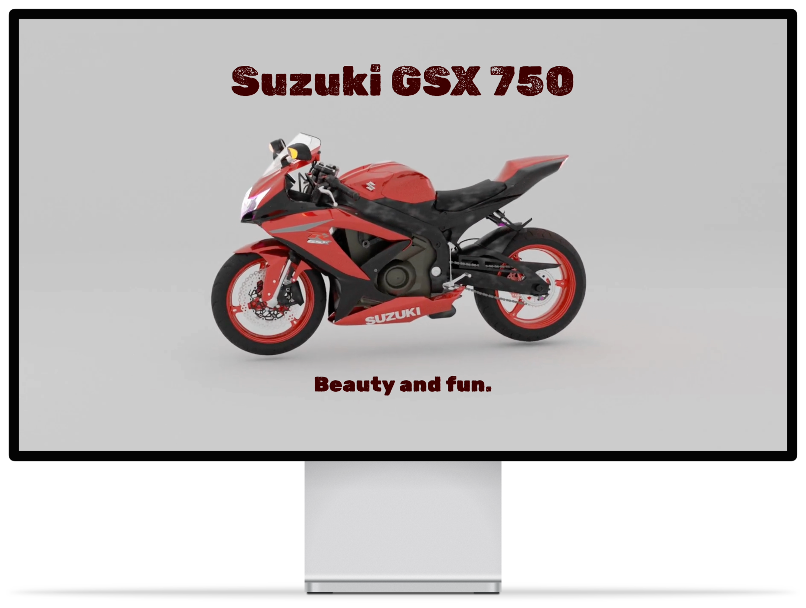
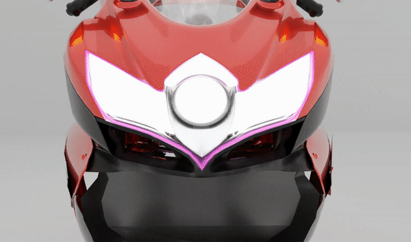

 

<h2 align="center">3D Animation with Blender</h2>

---

Demo of simple 3D animation.

 

 
 

## ⛏️ Built With 

- [Blender](https://www.blender.org) - 3D Animation
- [HTML](https://html.com) - Page Structure
- [CSS](https://www.w3.org/TR/CSS/) - Page Style
- [JavaScript](https://www.javascript.com/) - Logic
  - [GSAP](https://greensock.com/gsap/) - Animation library

## ✍️ Authors 

- [@IvanDF](https://github.com/IvanDF) - Design & Develop

See also my [website!](https://ivandf.dev)
New one is in progress.
